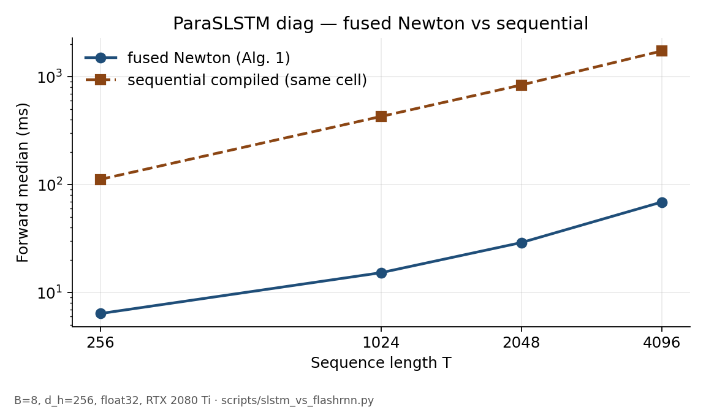
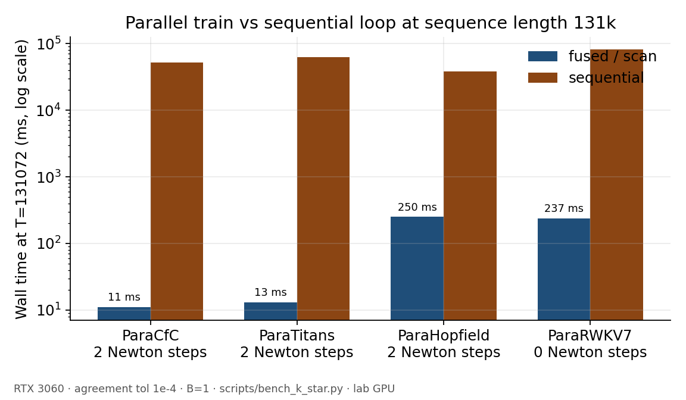

# ParaRNN

[](https://colab.research.google.com/github/bugkira/pararnn-torch/blob/main/notebooks/paraslstm_demo.ipynb)
[](https://github.com/bugkira/pararnn-torch/actions/workflows/ci.yml)
[](https://pypi.org/project/pararnn-torch/)
[](https://github.com/bugkira/pararnn-torch)
[](LICENSE)
[](https://doi.org/10.5281/zenodo.22302587)
[](https://arxiv.org/abs/2510.21450)
[](https://arxiv.org/abs/2603.14360)

**Hardware-efficient building blocks for nonlinear recurrence:** parallel
Newton+scan training (span O(log T)) and O(1) sequential decode —
GRU, LSTM, sLSTM, matrix-state, Liquid, Hopfield, RWKV-7, Titans-style memory,
and more.

Package **`pararnn-torch`**, import **`pararnn`**. Alpha — fused kernels are
Triton on CUDA (compute capability ≥ 8.0).

- [News](#news)
- [What you get](#what-you-get)
- [Models](#models)
- [Install](#install)
- [Quickstart](#quickstart)
- [Feel it (60s)](#feel-it-60s)
- [Benchmarks](#benchmarks)
- [Usage](#usage)
- [Training](#training)
- [Evaluation](#evaluation)
- [Examples](#examples)
- [API overview](#api-overview)
- [Compatibility](#compatibility)
- [Method](#method)
- [Citation](#citation)

## News

- **[2026-09]** K*(T) campaign through **T=131072**: CfC / Hopfield /
  Titans stay K*=2 (H1); RWKV-7 linear monoid K*=0. Auto
  schedules via `NewtonConfig(max_iters=None)`.
- **[2026-09]** Cell zoo: `ParaTitans`, `ParaRWKV7`, `ParaHopfield`, `ParaCfC`,
  `ParaNLRU` (v0.13–0.17).
- **[2026-09]** Product entry: `ParaSLSTMBlock`, `ParaSLSTMForCausalLM`
  (`labels` CE, safetensors), continuous batch + vLLM plugin hooks.
- **[2026-09]** Factorized Newton for `ParaGRU(mix='head')` / Dreamer slots;
  M²RNN factorized Jacobian + K*(T) asymptotics.

## What you get

ParaRNN is a **library for nonlinear recurrent sequence models** — the FLA /
FlashAttention role for cells whose Jacobian is structured enough for Newton +
associative scan.

- **Parallel train** — Alg. 1 Newton + PCR / fused Triton; measured speedups
  of 100–1000× vs same-cell sequential on long T
- **O(1) decode** — sequential `step`; CUDA `T=1` Triton `decode_step` (+ CUDA
  graphs via `decode_wx`)
- **Growing cell catalog** — diagonal, head-block, dense, and matrix-state
  Jacobians under one `ParaRNN` / `newton_apply` surface
- **Stack-ready entrypoints** — trunk block, CausalLM, paged state,
  continuous batch, speculative verify, optional vLLM registration
- **Honest depth** — measured K*(T) envelopes (`max_iters=None` or pin);
  lab grid through 131k tokens
- **Train hygiene** — packed eq. 2.6 VJP (no Triton atomics),
  `torch.compile` fullgraph presets, DDP / FSDP2, deterministic-path checks

**Swap paths** (details in [`docs/adoption.md`](docs/adoption.md)):

- Attention trunk → `ParaSLSTMBlock`
- Dreamer RSSM → `ParaGRU(mix='head', n_heads=8)`
- Liquid / CfC → `ParaCfC` (Δt as last channel of `x`)

## Models

| Cell | Jacobian | Parallel path | Notes |
|---|---|---|---|
| [`ParaSLSTM`](docs/cells.md#paraslstm-xlstm-style) | diag / head | fused Alg. 1 | main xLSTM-style fused path (`mix='diag'`) |
| [`ParaGRU`](docs/cells.md#paragru--paralstm-dreamer-style-block-gru) / `ParaLSTM` | diag / head | fused / factorized | Dreamer: `mix='head', n_heads=8` |
| [`ParaM2RNN`](docs/cells.md#param2rnn-research) | factor K×V | factorized Newton | matrix state; K*(T) ~ Θ(log T) |
| [`ParaNLRU`](docs/cells.md#paranlru) | diag | fused | Griffin / RG-LRU-style nonlinear slot |
| [`ParaCfC`](docs/cells.md#paracfc) | diag | fused | Liquid CfC; Δt = last channel of `x` |
| [`ParaHopfield`](docs/cells.md#parahopfield) | dense | `scan_dense` | Modern Hopfield; keep d_h ≤ 32 |
| [`ParaRWKV7`](docs/cells.md#pararwkv7) | linear monoid | associative `(G,U)` scan | RWKV-7 Goose; K*=0 |
| [`ParaTitans`](docs/cells.md#paratitans) | diag | fused | shallow L=1 surprise-GD memory |

Full snippets: [`docs/cells.md`](docs/cells.md). Newton+scan core follows
[Danieli et al., ICLR 2026](https://arxiv.org/abs/2510.21450). Extras (HF
wrappers, Mamba-predictor hybrids, IFT adjoint notes) are this repo’s.

## Install

| | Users | Contributors |
|---|---|---|
| Command | see below | `git clone … && uv sync --group dev` |
| PyTorch | bring your own (CPU or CUDA) | pinned in `pyproject.toml` (cu128) |
| Python | 3.10+ | 3.10+ |
| Fused Triton | CUDA CC ≥ 8.0 | same; else `scan_backend="auto"` → eager |

```bash
# when published on PyPI:
pip install pararnn-torch

# bleeding edge / until first PyPI release:
pip install "pararnn-torch @ git+https://github.com/bugkira/pararnn-torch"

# editable:
git clone https://github.com/bugkira/pararnn-torch && cd pararnn-torch
uv sync --group dev
uv run pytest -q -m "not cuda"
```

PyPI Trusted Publishing is wired in
[`.github/workflows/release.yml`](.github/workflows/release.yml). Hardware and
Triton troubleshooting: [`INSTALL.md`](INSTALL.md) · [`FAQs.md`](FAQs.md).

Place modules with `.to(device)` like any `nn.Module`. Data parallel:
[`docs/distributed.md`](docs/distributed.md). Lab benches:
[`scripts/`](scripts/README.md) (omitted from the wheel).

## Quickstart

### 1. Trunk block (drop-in residual mixer)

```python
import torch
from pararnn import NewtonConfig, ParaSLSTMBlock

device = torch.device("cuda" if torch.cuda.is_available() else "cpu")
block = ParaSLSTMBlock(64, mlp_ratio=4.0, config=NewtonConfig(max_iters=3)).to(device)
x = torch.randn(2, 128, 64, device=device)

block.train()
y = block(x)          # Newton + scan inside the recurrent branch
y.sum().backward()

block.eval()
y_eval = block(x)     # sequential step (CUDA T=1: decode_step)
```

### 2. CausalLM

```python
from pararnn import ParaSLSTMConfig, ParaSLSTMForCausalLM

cfg = ParaSLSTMConfig(vocab_size=256, hidden_size=64, num_hidden_layers=2, mlp_ratio=2.0)
model = ParaSLSTMForCausalLM(cfg).to(device)
ids = torch.randint(0, 256, (2, 32), device=device)

logits, loss = model(ids, labels=ids)
loss.backward()
out = model.generate(ids[:1, :8], max_new_tokens=16)
model.save_pretrained("./ckpt")   # config.json + model.safetensors
```

Smoke: [`examples/causal_lm_smoke.py`](examples/causal_lm_smoke.py) · continuous
batch: [`examples/continuous_batch.py`](examples/continuous_batch.py).

### 3. Cell + `ParaRNN`

```python
from pararnn import NewtonConfig, ParaGRU, ParaRNN

cell = ParaGRU(32, 64, device=device)
model = ParaRNN(cell, config=NewtonConfig(max_iters=3))
y = model(torch.randn(4, 128, 32, device=device))  # .train() → Newton
```

`.train()` → parallel Newton · `.eval()` → sequential `step` · CUDA `T=1` →
`decode_step`. Force either path with `solver='newton'|'sequential'`.

## Feel it (60s)

Z₂ prefix tagging ([Merrill et al.](https://arxiv.org/abs/2404.08819)): last-token
accuracy **1.0** at train length 16 and held-out 32 for ParaSLSTM Newton.

```bash
uv run python examples/parity.py
```

Expect a JSON summary with `"newton"` arm accuracy `1.0` at `T=16` and `T=32`.
Interactive tour: [`notebooks/paraslstm_demo.ipynb`](notebooks/paraslstm_demo.ipynb)
([Colab](https://colab.research.google.com/github/bugkira/pararnn-torch/blob/main/notebooks/paraslstm_demo.ipynb)).

## Benchmarks

Lab GPUs (RTX 2080 Ti / 3060) — honest consumer cards; regenerate plots with
`uv run python scripts/plot_readme_assets.py`.



Diag-sLSTM forward median (ms), B=8, d_h=256, float32, RTX 2080 Ti
(`scripts/slstm_vs_flashrnn.py`). Fused Newton = this library’s Alg. 1;
sequential = `torch.compile` of the same cell.

| T | fused Newton | sequential compiled |
|------:|-------------:|--------------------:|
| 256 | 6.4 | 112 |
| 1024 | 15.3 | 429 |
| 2048 | 29.1 | 840 |
| 4096 | 69.1 | 1735 |



Long-context K*(T) + wall time (`scripts/bench_k_star.py`, RTX 3060,
τ=1e-4, B=1):

| Cell | K* through T=131072 | @131k fused/scan vs seq |
|---|---|---|
| ParaCfC | 2 (H1) | ~11 ms vs ~52 s (~4600×) |
| ParaTitans | 2 (H1) | ~13 ms vs ~62 s (~5000×) |
| ParaHopfield | 2 (H1) | ~250 ms vs ~38 s (~150×) |
| ParaRWKV7 | 0 (linear) | ~237 ms vs ~81 s (~340×, slim 1×16) |

ParaNLRU smoke (3060, B=8, T=2048, d_h=256, K=3): fused
**~2.7 ms** vs sequential **~549 ms**.

```bash
uv run python scripts/bench_k_star.py --cell all --time
uv run python scripts/slstm_vs_flashrnn.py --config configs/bench/newton_slstm_flashrnn.yaml
```

## Usage

Layered entrypoints live above. Cell zoo snippets:
[`docs/cells.md`](docs/cells.md).

### sLSTM / xLSTM-style

```python
from pararnn import ParaRNN, ParaSLSTM

slstm = ParaRNN(ParaSLSTM(64, 64, mix="diag"), device=device)
y = slstm(torch.randn(4, 128, 64, device=device))
```

### Dreamer-style block GRU

```python
from pararnn import ParaGRU, ParaRNN

# Block-diagonal A_*; CUDA factorized Newton. LN stays outside the cell.
rssm_h = ParaRNN(ParaGRU(512, 512, mix="head", n_heads=8), device=device)
y = rssm_h(torch.randn(4, 64, 512, device=device))
```

Smoke: [`examples/rssm_recurrent.py`](examples/rssm_recurrent.py).

### Research cells

`ParaM2RNN`, `ParaNLRU`, `ParaCfC`, `ParaHopfield`, `ParaRWKV7`, `ParaTitans` —
see [`docs/cells.md`](docs/cells.md). Pin Newton depth with `max_iters=int`,
`max_iters=None` (auto K*(T)), or `newton_iters_by_t={…}`.

## Training

BabyLM / diag-sLSTM stack: [`scripts/train_babylm.py`](scripts/train_babylm.py)
with configs under [`configs/train/`](configs/train/). Optional extras:
`pip install "pararnn-torch[train,lm]"`. Log runs with MLflow (`mlflow` group).
Distributed wrap: [`docs/distributed.md`](docs/distributed.md) ·
[`examples/ddp_fsdp.py`](examples/ddp_fsdp.py).

## Evaluation

- **Numerics** — sequential ↔ Newton agreement (`pytest -m cuda`); residual
  history on divergence.
- **Expressivity** — Z₂ parity ([`examples/parity.py`](examples/parity.py)).
- **Wall-clock** — [`scripts/bench_k_star.py`](scripts/bench_k_star.py),
  [`scripts/slstm_vs_flashrnn.py`](scripts/slstm_vs_flashrnn.py).
- **LM smoke** — BabyLM drop-in / distill notes under [`results/`](results/).

## Examples

| Script | What | Command |
|---|---|---|
| [`causal_lm_smoke.py`](examples/causal_lm_smoke.py) | CausalLM CE + generate + safetensors | `uv run python examples/causal_lm_smoke.py` |
| [`continuous_batch.py`](examples/continuous_batch.py) | Packed prefill + T=1 via `BlockStackPool` | `uv run python examples/continuous_batch.py` |
| [`rssm_recurrent.py`](examples/rssm_recurrent.py) | Dreamer `ParaGRU(mix='head')` | `uv run python examples/rssm_recurrent.py` |
| [`parity.py`](examples/parity.py) | Z₂ vs linear SSM | `uv run python examples/parity.py` |
| [`decode_step.py`](examples/decode_step.py) | T=1 Triton vs eager | `uv run python examples/decode_step.py` |
| [`ddp_fsdp.py`](examples/ddp_fsdp.py) | DDP / FSDP2 wrap | `uv run torchrun --nproc_per_node=2 examples/ddp_fsdp.py` |
| [`speculative_draft.py`](examples/speculative_draft.py) | Linear-draft verify | `uv run python examples/speculative_draft.py` |
| [`xlstm_hybrid.py`](examples/xlstm_hybrid.py) | NX-AI `sLSTMBlock` + fused ParaSLSTM | `uv add xlstm && uv run python examples/xlstm_hybrid.py` |

More: [`scripts/README.md`](scripts/README.md). Distributed demos:
[`archive/distributed-demos`](https://github.com/bugkira/pararnn-torch/tree/archive/distributed-demos).

## API overview

- **Cells** — [`docs/cells.md`](docs/cells.md); wrap with `ParaRNN` or call
  `newton_apply` / `sequential_apply` (`ParaM2RNN`, `ParaRWKV7`).
- **Trunk** — `ParaSLSTMBlock(d_model, mlp_ratio=4)` ([`docs/adoption.md`](docs/adoption.md)).
- **CausalLM / serve** — `ParaSLSTMForCausalLM`, `BlockStackPool`,
  `vllm.general_plugins` ([`docs/vllm.md`](docs/vllm.md)).
- **Solver** — `NewtonConfig(scan_backend="auto", max_iters=None|int)`;
  `picard_iters` for sLSTM / M²RNN warm-starts.
- **Speculative** — `verify_linear_draft`.
- **Paged** — `PagedStatePool` / `paged_apply`.
- **Decode** — `decode_step`, `decode_wx`, `can_decode_step`.

```python
from pararnn.solvers import newton_apply, sequential_apply

h = newton_apply(cell, x)
h = sequential_apply(cell, x)
```

**Docs:** adoption · cells · [`xlstm.md`](docs/xlstm.md) ·
[`distributed.md`](docs/distributed.md) · [`vllm.md`](docs/vllm.md) ·
[`structure.md`](docs/structure.md) · [`INSTALL.md`](INSTALL.md) ·
[`FAQs.md`](FAQs.md).

## Compatibility

- **`torch.compile`:** compile-safe preset (fixed K, no residual host sync)
  → `fullgraph=True` on eager and fused (`tests/numerics/test_compile.py`).
- **AMP:** module/`x` dtype explicit; under outer autocast Newton opts out so
  eq. 2.6 stays one dtype (`tests/numerics/test_autocast.py`).
- **DDP / FSDP / checkpoint:** [`docs/distributed.md`](docs/distributed.md);
  `NewtonConfig(recompute=True)` for ultra-long train T.
- **Determinism:** packed VJP uses tile `tl.sum` then `.sum` (no `tl.atomic*`);
  set `CUBLAS_WORKSPACE_CONFIG=:4096:8` under
  `torch.use_deterministic_algorithms(True)`.

## Method

Training solves
$`F(H)_t = h_t - f(h_{t-1}, x_t) = 0`$
with Newton + parallel scan (Alg. 1). Layout:
[`src/pararnn/layout.py`](src/pararnn/layout.py).
GRU/LSTM warm-start App. A ($`h_l^{(0)}=f(0,x_l)`$); sLSTM zero-hidden + Picard.
Recurrent clip App. C.1. Backward: paper eq. 2.6. M²RNN uses the factorized map
$`J[\Delta]=f\Delta+(1-f)(1-Z^{\odot 2})\odot(\Delta W)`$.

Critical depth K*(T): [`scripts/bench_k_star.py`](scripts/bench_k_star.py);
auto schedules in `pararnn.solvers.newton.k_star`.

## Citation

If you use this library, please cite the software and the ParaRNN framework.

```bibtex
@software{sereda2026pararnn,
  author       = {Sereda, Daniil},
  title        = {{pararnn-torch}: Hardware-efficient parallel training for nonlinear {RNNs}},
  year         = {2026},
  url          = {https://github.com/bugkira/pararnn-torch},
  version      = {0.17.1}
}

@misc{sereda2026paraslstm,
  author       = {Sereda, Daniil},
  title        = {{ParaSLSTM}: Work-Efficient Parallel Training of Nonlinear {sLSTM} via Tropical Warm-Starts},
  month        = sep,
  year         = 2026,
  publisher    = {Zenodo},
  doi          = {10.5281/zenodo.22302587},
  url          = {https://doi.org/10.5281/zenodo.22302587}
}

@inproceedings{danieli2026pararnn,
  title        = {{ParaRNN}: Unlocking Parallel Training of Nonlinear {RNNs} for Large Language Models},
  author       = {Danieli, Federico and Rodr{\'i}guez, Pau and Sarabia, Miguel and Suau, Xavier and Zappella, Luca},
  booktitle    = {International Conference on Learning Representations},
  year         = {2026},
  note         = {Oral. arXiv:2510.21450},
  url          = {https://arxiv.org/abs/2510.21450}
}
```

## References

- Danieli et al. *ParaRNN*. ICLR 2026 (Oral). [arXiv:2510.21450](https://arxiv.org/abs/2510.21450).
- Mishra et al. *M²RNN*. [arXiv:2603.14360](https://arxiv.org/abs/2603.14360).
- Sereda. *ParaSLSTM*. [doi:10.5281/zenodo.22302587](https://doi.org/10.5281/zenodo.22302587).
- Beck et al. *xLSTM*. [arXiv:2405.04517](https://arxiv.org/abs/2405.04517).
- Lim et al. *DEER*. ICLR 2024. [arXiv:2309.12252](https://arxiv.org/abs/2309.12252).
- Merrill et al. *The Illusion of State in State-Space Models*. [arXiv:2404.08819](https://arxiv.org/abs/2404.08819).

## License

MIT, [LICENSE](LICENSE).
