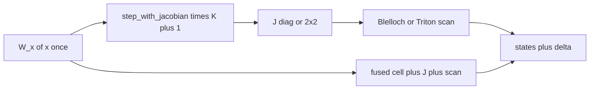

# Bottlenecks and improvement list

Where the eager PyTorch Newton+scan actually spends time and memory on this box, what is worth changing, and how sure we are. Effects are relative to this 2080 Ti prototype, **not** to Danieli et al. fig. 2/5 (A100 + fused CUDA).

Do not switch to the 3060 to dodge OOM. Do not copy `third_party/ml-pararnn` kernels.

Rows are ordered by **priority**: (impact on training or honest numbers) × (confidence) × (cheapness). “Done” is the same rule, not chronological.

Verify runtime changes with numerics tests, then [`scripts/bench_time.py`](../scripts/bench_time.py) on the **2080 Ti by name**, MLflow `cell-forward-bench`.

## Next

Library completeness after v0.2 is **done** (`scan_backend=auto`, NewtonStats /
early-stop, fused `h0`, layer list / `return_hidden` / `output_hidden`).
Remaining items are **other science**, not package polish.

| Pri | Change | Why this high | Effect | Confidence |
|---|---|---|---|---|
| 1 | Hybrid Mamba-2 predictor + **one** Newton (ours, not Apple) | DEER: Newton wants a good guess. After residual early-stop. | **Up to ~3×** if the guess is close. | **Low** until ablation |
| 2 | IFT adjoint (Bai / DEQ) | Eq. 2.6 is in. IFT is extra. | \(O(1)\) in solver depth. | **Low** until 2.6 is the bottleneck |
| 3 | Para-sLSTM **head fused / LM** | Diag cell + Picard + 4×4 fused is on `para-slstm`. FlashRNN `cuda_fused` needs CC 8.0 (2080 Ti is 7.5). Head mix still out. | Matching K=3 at width 256 via auto P. | **Medium** on FlashRNN until Ampere; **high** on head mix |
| 4 | HF / SlimPajama / 125M | Empty `PreTrainedModel` is worse than none. | Paper-scale claim. | **Low** until a real train loop |

Do **not** bake `torch.compile` into `src/` (Dynamo 4–113 s per new \(T\)).
Do **not** pick `pararnn.device` inside `ParaRNN.forward`.
Do **not** treat `fused` as “any \(f\)”.

## Done

| Pri | Change | Why this was first | Result |
|---|---|---|---|
| 0 | ``scan_backend="auto"`` by tensor (fused if CUDA GRU/LSTM fp16/32, else Triton scan, else eager). Log the choice. Fused kernels prepend ``h0``. Early-stop + ``NewtonStats``. Layer: list of cells, ``return_hidden``, LSTM ``output_hidden``. | Default eager hid fused; fused ignored nonzero ``h0``. | Default is ``auto``. Fused+``h0`` matches sequential. Residual is an API. |
| 1 | Any ``step(h, x)`` via Autograd Jacobian (DEER / Lim et al.). ``jacobian="auto"``: analytic if the cell has ``step_with_jacobian``, else ``torch.func``. | Two hardcoded cells is not a library. | Custom channelwise cell and dense mix (``jac_structure="dense"``) match sequential. Ones-JVP is exact iff ``f`` is channelwise; otherwise set ``dense``. Fused Newton stays ParaGRU/LSTM (not any ``f``). |
| 2 | Eq. 2.6 cell VJP packed on CUDA for ParaGRU/ParaLSTM (Triton elementwise + ``W_x`` GEMM). Reverse scan already Triton when ``scan_backend`` is ``triton``/``fused``. | Backward was ``autograd.grad(cell.step)``. | Packed VJP matches Autograd VJP. Existing BPTT tests still pass. Custom cells keep Autograd on ``step`` (their ops are already CUDA). |
| 3 | fp16 DRAM / fp32 Newton accumulators on Turing. Agreement tests **separately** (atol \(2\times10^{-3}\)). **Not bf16**. | Halves scan DRAM. TC help `W_x` only. | Smoke 10/50, same process as fp32 fused: at \(T=2048\) GRU **1.80 vs 2.61 ms** (**1.45×**), **66 vs 123 MiB** (**1.86×**); LSTM **5.45 vs 6.41 ms** (**1.18×**), **107 vs 205 MiB** (**1.91×**). Short \(T\) is slower. Residual \(\sim10^{-3}\). See [fp16](#fp16). |
| 4 | Triton **fused Newton** (cell + J + scan per Alg. 1 iter). Opt-in `scan_backend="fused"`. GEMM `W_x` stays in PyTorch. Not Apple's kernel. Backward still eq. 2.6. | Newton still launched the eager cell \(K+1\) times after the scans landed. Paper 665× is fused CUDA, not this. | Smoke 10/50, \(T=2048\): GRU fused **2.4 ms** vs naive ParaRNN 27 ms (**11×**) vs naive RNN 959 ms (**400×**); LSTM **6.5 ms** vs 62 ms (**9.6×**) vs 1338 ms (**207×**). Peak mem vs naive ParaRNN **~3–4×** lower. ParaSLSTM diag fused **P=0 30 ms** is a **diverged** Newton; sequential-matched P=3 is **77 ms** vs compiled seq 814 ms (**11×**) vs naive RNN 1484 ms (**19×**). See [Fused Newton](#fused-newton) and [Fused sLSTM](#fused-slstm). |
| 5 | LSTM 2×2 as four muls, not `einsum`→`bmm`; Blelloch scan (not Hillis–Steele). No `torch.associative_scan` (CUDA/compile prototype, no CPU, no autograd). | **86% of LSTM CUDA** was tiny GEMVs. HS was \(O(T\log T)\) traffic. | Smoke: LSTM \(T=512\) 113→**46 ms**; \(T=2048\) 537→**82 ms**, 7.5 GiB→**719 MiB**; \(T=4096\) **fits, 1.4 GiB** (was OOM). GRU \(T=2048\) 29→**36 ms** (gather tax). |
| 6 | Call-site `torch.compile(newton_apply)` (`reduce-overhead`). **Not** in `src/`. App. B `min_ms` is after warmup and **hides** Dynamo. | Launch tax on small \(T\). | Steady-state GRU \(T\le 256\) **~20–40×**; LSTM \(T=64\) **~16×**. Compile itself is **4–113 s** per new \(T\). LSTM at LM length needs **~2k forwards** to break even. See [Compile Newton](#compile-newton). |
| 7 | Triton **diag** + **2×2** scan (`tl.associative_scan`, two-level tiles). Opt-in `scan_backend="triton"`. Not Apple's kernel. | Eager Blelloch gather tax. | Scan-only smoke (B=8, \(d_h=256\), 10/50, not App. B): diag **~16–34×**; 2×2 \(T=64\ldots4096\) eager 13→33 ms vs Triton 0.18→3.5 ms (**~10–74×**). Newton still pays the eager cell. |
| 8 | Honest sequential: `sequential_apply_compiled` | Speedup vs a Python loop that computed unused J is not a result. | Smoke GRU \(T=64\): eager 29, compiled 24, Newton ~15 ms now. |
| 9 | One `W_x(x)` per Newton forward (eq. 3.1: \(Bx\) independent of \(h\)). Optional `wx=` on `step` / `step_with_jacobian`. Eager sequential also precomputes `(B,T,*)`. Backward VJP still runs `W_x` with grad. | Four identical GEMMs (init + \(K=3\)). | Same numerics. Small \(T\) kernel-count; large \(T\) scan still dominates. |
| 10 | Backward = eq. 2.6 reverse scan + cell VJP | Training would OOM on \(O(KT)\) Newton iterates. | Grads match sequential BPTT. |
| 11 | Preallocated scan buffers (no per-round `cat`) | Allocator high-water. HS itself is gone; the shift helper is obsolete. | GRU \(T=2048\) peak ~330 MiB (then Blelloch). |
| 12 | `step` without Jacobian | Sequential paid for unused \(J\). | Sequential **1.2–1.6×**. |
| 13 | CUPTI profile | Otherwise GEMM/tensor-core story leads. | See [Profile](#profile). |

## Sources

- Bench: App. B (CUDA events, 20 warmup, 100 runs, **min** ms). [`configs/bench/cell_forward.yaml`](../configs/bench/cell_forward.yaml): batch=8, \(d_{\mathrm{in}}=d_h=256\), \(K=3\), float32. CSV: `outputs/bench_cell_forward.csv` (gitignored). **Table below is the first App. B run** (eager sequential with J inside `step`, scan still `cat`). Do not mix it with later smokes.
- Hot path: [`newton.py`](../src/pararnn/solvers/newton.py), [`scan.py`](../src/pararnn/solvers/scan.py), cells.
- Paper App. A/B; Apple modes in [`apple-ml-pararnn.md`](apple-ml-pararnn.md).
- Hardware: Turing 2080 Ti, 11 GiB. FP16 tensor cores. **No bf16 TC**.

## Diagnosis (first App. B, before the Done list)

| Cell | T | Newton min ms | Peak MiB | vs eager sequential (then) |
|---|---|---|---|---|
| ParaGRU | 16 | 6.85 | 24 | 1.90× |
| ParaGRU | 256 | 8.90 | 303 | 23.4× |
| ParaGRU | 1024 | 16.7 | 1323 | 50.8× |
| ParaGRU | 4096 | 58.5 | 5835 | 57.7× |
| ParaLSTM | 16 | 13.0 | 43 | 1.58× |
| ParaLSTM | 128 | 25.2 | 364 | 6.47× |
| ParaLSTM | 1024 | 246 | 3539 | 5.41× |
| ParaLSTM | 2048 | 537 | 7547 | 5.03× |
| ParaLSTM | 4096 | OOM during Newton | — | sequential 5470 ms |

ParaGRU Newton **flat ~7–9 ms to \(T=256\)**, then linear (58 ms / 5.8 GiB at \(T=4096\)). ParaLSTM ~**19× slower than GRU** at \(T=2048\). That table’s sequential column is **inflated** (J inside `step`); use compiled sequential for claims.

## Compile Newton

Call-site only: `uv run python scripts/bench_time.py --config configs/bench/newton_compile.yaml`. `torch.compile` is **not** in `src/`. Mode `reduce-overhead` (CUDA graphs at static \(T\)). MLflow `newton-compile-bench`. CSV: `outputs/bench_newton_compile.csv`.

App. B `min_ms` is **after** 20 warmup + 100 runs. That number does not include Dynamo / Inductor / graph capture. The first compiled call is timed separately (`compile_s`). Break-even uses **median** save per step (CUDA-graph `min` can be a lucky short capture — GRU \(T=16\) min 0.21 ms vs median 2.11 ms).

\(N = \texttt{compile\_s} / (\texttt{eager\_median} - \texttt{compiled\_median})\). One new \(T\) is one new graph (Inductor warned after 9 sizes).

| Cell | T | Eager median ms | Compiled median ms | Steady-state | Compile s | Break-even forwards |
|---|---|---|---|---|---|---|
| ParaGRU | 16 | 11.1 | 2.11 | 5.3× | 4.2 | 470 |
| ParaGRU | 64 | 14.1 | 0.34 | 42× | 0.5 | 40 |
| ParaGRU | 256 | 18.0 | 0.79 | 23× | 0.7 | 40 |
| ParaGRU | 2048 | 42.9 | 14.9 | 2.9× | 1.4 | 50 |
| ParaGRU | 4096 | 83.1 | 15.1 | 5.5× | 16 | 240 |
| ParaLSTM | 16 | 24.3 | 2.63 | 9.2× | 7.7 | 360 |
| ParaLSTM | 64 | 46.5 | 3.09 | 15× | 7.6 | 180 |
| ParaLSTM | 512 | 45.9 | 6.38 | 7.2× | 88 | 2200 |
| ParaLSTM | 2048 | 59.1 | 23.1 | 2.6× | 104 | 2900 |
| ParaLSTM | 4096 | 104.5 | 45.8 | 2.3× | 113 | 1900 |

GRU \(T\ge 32\) compile is cheap in this process because Inductor already saw nearby shapes. LSTM \(T\ge 128\) is the honest tax: **1–2 minutes** before the first fast step. A 100-run App. B does **not** pay that back. A long training run at **one** padded \(T\) might (~2k–3k steps). A sweep over lengths, or a notebook that compiles once and exits, does not.

Default Dynamo `recompile_limit=8` silently fell back to eager on the 9th \(T\) (GRU \(T=4096\) and all LSTM in the first attempt). The script raises it to 64 for this sweep only.

## Fused Newton

Opt-in: `NewtonConfig(scan_backend="fused")`. Triton cell + Jacobian + scan per Alg. 1 iteration; `W_x(x)` is still one PyTorch GEMM. Not Apple's `parallel_FUSED`. Backward is still eq. 2.6 (J at the fixed point, reverse scan).

`uv run python scripts/bench_time.py --config configs/bench/newton_fused.yaml`. MLflow `newton-fused-bench`. CSV: `outputs/bench_newton_fused.csv`. **10 warmup / 50 runs, min ms, not App. B.** Same process, 2080 Ti, B=8, \(d_h=256\), \(K=3\).

Baselines in this table:

- **Naive RNN** — `sequential_apply` (Python unroll of `cell.step`, no Jacobian).
- **Naive ParaRNN** — eager Newton + Blelloch (`scan_backend="eager"`).
- **Fused** — `scan_backend="fused"`.

Compiled sequential (`sequential_apply_compiled`) is the honest RNN timing baseline; it is **not** the paper's naive sequential. Do not quote the vs-RNN column as fig. 2/5 (A100 fused CUDA, 665×).

| Cell | T | Naive RNN | Naive ParaRNN | Fused | vs naive RNN | vs naive ParaRNN |
|---|---|---|---|---|---|---|
| ParaGRU | 64 | 27.5 | 16.0 | **0.72** | 38× | 22× |
| ParaGRU | 256 | 113 | 20.6 | **0.80** | 140× | 26× |
| ParaGRU | 512 | 234 | 29.6 | **0.90** | 261× | 33× |
| ParaGRU | 2048 | 959 | 27.0 | **2.40** | 400× | 11× |
| ParaGRU | 4096 | 1925 | 38.6 | **4.73** | 407× | 8.2× |
| ParaLSTM | 64 | 58.2 | 34.5 | **0.78** | 75× | 44× |
| ParaLSTM | 256 | 172 | 43.7 | **0.88** | 195× | 50× |
| ParaLSTM | 512 | 352 | 50.7 | **1.57** | 225× | 32× |
| ParaLSTM | 2048 | 1338 | 62.2 | **6.45** | 207× | 9.6× |
| ParaLSTM | 4096 | 2760 | 104.3 | **12.3** | 224× | 8.4× |

Times in ms (min). Peak memory is the next table.

**Honest sequential** — `sequential_apply_compiled` (`reduce-overhead`, CUDA graphs, after warmup). Same smoke. This is the RNN baseline to quote, not the Python loop.

| Cell | T | Compiled seq | Fused | vs compiled seq |
|---|---|---|---|---|
| ParaGRU | 64 | 23.8 | **0.72** | 33× |
| ParaGRU | 256 | 98.6 | **0.80** | 123× |
| ParaGRU | 512 | 224 | **0.90** | 250× |
| ParaGRU | 2048 | 812 | **2.40** | 339× |
| ParaGRU | 4096 | 1569 | **4.73** | 332× |
| ParaLSTM | 64 | 30.0 | **0.78** | 39× |
| ParaLSTM | 256 | 104 | **0.88** | 118× |
| ParaLSTM | 512 | 219 | **1.57** | 140× |
| ParaLSTM | 2048 | 865 | **6.45** | 134× |
| ParaLSTM | 4096 | 1767 | **12.3** | 143× |

At \(T=64\) LSTM, eager Newton is *slower* than compiled sequential (34.5 vs 30.0 ms); fused is not.

Peak allocated MiB (`torch.cuda.max_memory_allocated`, same smoke). Ratio is naive ParaRNN / fused.

| Cell | T | Naive RNN | Compiled seq | Naive ParaRNN | Fused | vs naive ParaRNN |
|---|---|---|---|---|---|---|
| ParaGRU | 64 | 16 | 12 | 22 | **15** | 1.5× |
| ParaGRU | 256 | 34 | 33 | 57 | **25** | 2.3× |
| ParaGRU | 512 | 56 | 35 | 103 | **39** | 2.7× |
| ParaGRU | 2048 | 193 | 50 | 379 | **123** | 3.1× |
| ParaGRU | 4096 | 375 | 98 | 747 | **235** | 3.2× |
| ParaLSTM | 64 | 18 | 59 | 34 | **18** | 1.9× |
| ParaLSTM | 256 | 40 | 43 | 103 | **35** | 3.0× |
| ParaLSTM | 512 | 69 | 46 | 195 | **59** | 3.3× |
| ParaLSTM | 2048 | 245 | 82 | 747 | **205** | 3.6× |
| ParaLSTM | 4096 | 479 | 162 | 1483 | **399** | 3.7× |

Fused drops **~3–4×** vs eager Newton at LM length because \(J\) never becomes a full PyTorch tensor. It still uses **more** than compiled sequential (scan tiles + \(K\) residuals): GRU \(T=4096\) 98→235 MiB, LSTM 162→399. Compiled LSTM \(T=64\) at 59 MiB is the CUDA-graph capture, not the unroll.

Short \(T\) is launch-bound. At training length: **~10× vs naive ParaRNN**, **~130–340× vs compiled sequential**, **~200–400× vs the Python loop**. None of these is 665×. Agreement vs sequential stayed \(\sim 10^{-7}\).

## Fused sLSTM

Diag mix only (`newton_slstm.py`, 4×4 SRAM). Head/dense raise. Zero-hidden
init, not App. A. Same smoke protocol as the GRU table, 2080 Ti, B=8,
\(d_h=256\), \(K=3\), 10/50, min ms. Details and the K-curve:
[`para-slstm.md`](para-slstm.md).

**P=0** ([`newton_slstm.yaml`](../configs/bench/newton_slstm.yaml)): fused
\(T=2048\) **30.3 ms** times a **diverged** Newton (max |par − seq| is 17 …
\(10^{14}\)). Do not quote GRU's 11×/400× from that table.

**P=3** ([`newton_slstm_picard.yaml`](../configs/bench/newton_slstm_picard.yaml)),
sequential-matched (fused |par − seq| ≤ **2.8e-4**):

| T | Naive RNN | Compiled seq | Naive ParaRNN | Fused | vs RNN | vs compiled | vs eager N |
|---|---|---|---|---|---|---|---|
| 64 | 43.0 | 23.9 | 55.1 | 37.7 | 1.1× | 0.63× | 1.5× |
| 256 | 179 | 100 | 73.9 | **47.4** | 3.8× | 2.1× | 1.6× |
| 512 | 355 | 201 | 92.1 | **74.0** | 4.8× | 2.7× | 1.2× |
| 1024 | 726 | 395 | 121 | **65.1** | 11× | 6.1× | 1.9× |
| 2048 | 1484 | 814 | 207 | **77.1** | 19× | **11×** | 2.7× |

Matching sequential costs wall time vs P=0 fused (**77 vs 30 ms** at
\(T=2048\)): three frozen-gate scans + a Newton in basin. Still **11×** vs
compiled sequential, **not** GRU fused 2.4 ms. Peak MiB fused 27 → 550 vs
eager Newton 71 → 1946. At \(T=64\) fused+Picard loses to compiled seq.

FlashRNN (NX-AI, ICLR 2025) is the sequential competitor. `cuda_fused`
needs `nvcc` and CC **8.0+**; this 2080 Ti is **7.5**, so the harness
uses `triton_fused`. Import always hits `torch.utils.cpp_extension`,
which requires `CUDA_HOME`. This box has no system toolkit; the bench
sets `CUDA_HOME` to the pip `nvidia-cuda-runtime` wheel
(`include/cuda.h`). That is enough to import, not enough to compile
`cuda_fused` (`nvcc` is missing, and the kernel is `sm_80`).

Heads on Turing: **8×32** at \(d_h=256\). D=64 overflows 64 KiB smem;
D=1 (diag) does not compile. This is **not** `mix='diag'`. Optional
extra: `uv sync --extra flashrnn` (NXAI Community License, not MIT).

[`newton_slstm_flashrnn.yaml`](../configs/bench/newton_slstm_flashrnn.yaml),
same 10/50 min ms, B=8, \(d_h=256\), K=3, auto P, `require_agreement`
atol \(10^{-3}\). Fused vs FlashRNN (`>1` = fused faster):

| T | fused (auto P) | flashrnn `triton_fused` | fused / FR |
|---|---|---|---|
| 64 | 18.0 (P=1) | **0.78** | 0.04× |
| 256 | 47.0 (P=3) | **1.30** | 0.03× |
| 512 | 55.7 | **1.99** | 0.04× |
| 1024 | 62.5 | **3.03** | 0.05× |
| 2048 | 77.3 | **5.76** | 0.07× |

T=2048 fused matches sequential to \(3\times10^{-4}\). FlashRNN is
**~13×** faster than matched fused Newton. Do not quote ADD_TASK's
20–50× vs FlashRNN; that needs Ampere `cuda_fused`. The 11× in the
P=3 table is vs compiled PyTorch unroll, not vs FlashRNN.

## fp16

Turing: fp16 tensor cores exist; **no bf16 TC**. Activations, \(J\) tiles, and residuals stay fp16 in DRAM; Newton/scan algebra is fp32 inside Triton (`load_acc` / `store_acc`) and in eager Blelloch. `W_x` is still a PyTorch GEMM — that is where TC help. Fused and triton backends **reject bfloat16**. Agreement is vs sequential in the **same** dtype (atol \(2\times10^{-3}\)), not vs fp32 sequential.

`uv run python scripts/bench_time.py --config configs/bench/newton_fp16.yaml`. MLflow `newton-fp16-bench`. CSV: `outputs/bench_newton_fp16.csv`. **10 warmup / 50 runs, min ms, not App. B.** Same process, 2080 Ti, B=8, \(d_h=256\), \(K=3\), modes fused only. fp32 numbers here are the paired run, not the earlier fused-vs-naive table (GRU \(T=2048\) was 2.40 ms there, **2.61 ms** here).

Times in ms (min). Speedup is fp32 / fp16 (>1 is faster).

| Cell | T | fp32 | fp16 | vs fp32 |
|---|---|---|---|---|
| ParaGRU | 64 | 0.92 | 1.15 | 0.80× |
| ParaGRU | 256 | 0.72 | 0.84 | 0.86× |
| ParaGRU | 512 | 0.70 | 0.84 | 0.84× |
| ParaGRU | 2048 | 2.61 | **1.80** | **1.45×** |
| ParaGRU | 4096 | 4.68 | **3.48** | **1.35×** |
| ParaLSTM | 64 | 0.81 | 1.19 | 0.68× |
| ParaLSTM | 256 | 0.83 | 0.84 | 0.99× |
| ParaLSTM | 512 | 1.50 | **1.08** | **1.38×** |
| ParaLSTM | 2048 | 6.41 | **5.45** | **1.18×** |
| ParaLSTM | 4096 | 12.4 | **10.1** | **1.22×** |

Peak allocated MiB. Ratio is fp32 / fp16.

| Cell | T | fp32 | fp16 | vs fp32 |
|---|---|---|---|---|
| ParaGRU | 64 | 15 | 13 | 1.2× |
| ParaGRU | 256 | 25 | 17 | 1.5× |
| ParaGRU | 512 | 39 | 24 | 1.6× |
| ParaGRU | 2048 | 123 | **66** | **1.86×** |
| ParaGRU | 4096 | 235 | **122** | **1.92×** |
| ParaLSTM | 64 | 19 | 16 | 1.2× |
| ParaLSTM | 256 | 35 | 22 | 1.6× |
| ParaLSTM | 512 | 59 | 34 | 1.7× |
| ParaLSTM | 2048 | 205 | **107** | **1.91×** |
| ParaLSTM | 4096 | 399 | **204** | **1.96×** |

Memory at LM length is **~2×** as expected (half DRAM). Time is **1.2–1.45×** at \(T\ge 2048\), not 2×: the scan is still math-heavy in fp32, and `W_x` is one GEMM. Short \(T\) is **slower** (fp16↔fp32 convert + launch; GEMM too small for TC). Max |fused−seq| was \(9.8\times10^{-4}\) (LSTM \(T=4096\): \(1.2\times10^{-3}\)). This is not AMP-like-A100 and not 665×.

## Gemini vs measurement

| Suggestion | Keep? | Correction |
|---|---|---|
| compile / CUDA Graphs | Yes as **opt-in at fixed \(T\)**, not a library default | Steady-state is real. Compile tax is 4–113 s. Do not quote App. B `min_ms` as if Dynamo were free. |
| Fused CUDA/Triton PCR | Yes, **fused Newton is in** (`scan_backend="fused"`) | Still not Apple's kernel. Vs naive ParaRNN **~8–11×** at LM length; vs naive RNN **~200–400×**. Not 665×. |
| FP16/BF16 + tensor cores | fp16 DRAM + fp32 accum **is in** | No bf16 TC on Turing. TC help `W_x` only. Scan is not 2× at short \(T\) (slower). Residual \(\sim10^{-3}\). |

## Profile

`uv run python scripts/profile_hotpath.py`. Traces: `outputs/profile/`. MLflow `hotpath-profile`. 10/20 runs, not App. B.

**Sequential without J** (before compiled baseline):

| Case | App. B (J in `step`) | `step` only | Ratio |
|---|---|---|---|
| ParaGRU \(T=64\) | 49.8 ms | 41.9 | 1.19× |
| ParaGRU \(T=2048\) | 1654 | 1180 | 1.40× |
| ParaLSTM \(T=512\) | 671 | 412 | 1.63× |

**Newton CUDA** (ATen `self_cuda`; ignore `record_function` %):

- GRU \(T=64\): CUDA 7.9 ms, CPU 167 ms → launches. Compile-Newton cuts this **after** Dynamo pays.
- GRU \(T=2048\): `mul` 40%, `add` 21%, `cat` 16% (cat since removed), `W_x` 8%.
- LSTM \(T=512\): **`aten::bmm` was 86%** (fixed: elementwise 2×2 + Blelloch).

## Do not

- 3060 as a memory overflow. Stay on 2080 Ti by **name**.
- Copy Apple `csrc/`.
- Bake `torch.compile` into `src/`. Opt-in at the call site; log `compile_s`.
- Quote compiled `min_ms` without the compile wall time.
- Quote fused × as fig. 2/5 or 665×. The smoke table is 2080 Ti, 10/50, vs *our* naive RNN / naive ParaRNN.
- bf16 / “tensor cores for the scan”.
- Quote the first App. B 50× as if it were vs compiled sequential.
- Compare our ms to fig. 2/5.

MLflow: App. B → `cell-forward-bench`. Compile-Newton → `newton-compile-bench`. Fused Newton → `newton-fused-bench`. fp16 fused → `newton-fp16-bench`. Profiler → `hotpath-profile`. Tag `gpu=NVIDIA GeForce RTX 2080 Ti`.
